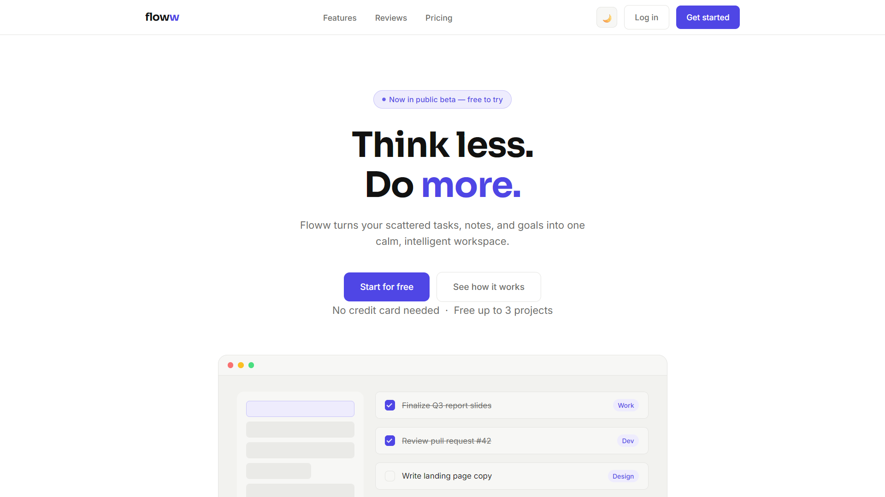
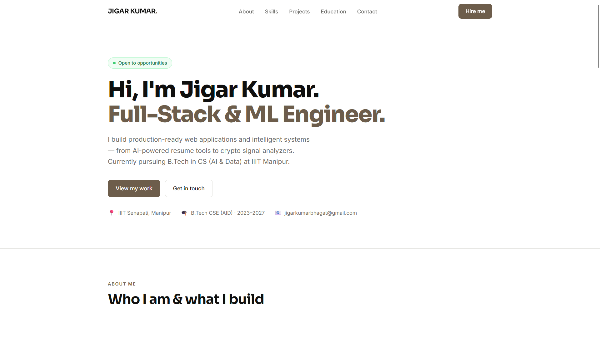
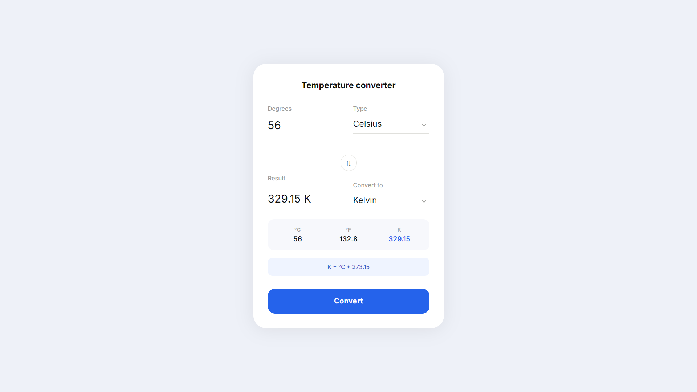

# Oasis Infobyte Web Development & Designing Internship (OIBSIP)

<p align="center">
  <strong>Web Development & Designing Internship Portfolio</strong><br>
  Showcasing responsive websites and interactive web applications built using modern frontend technologies.
</p>

---

## About

This repository contains the projects completed during the **Oasis Infobyte Web Development & Designing Internship (OIBSIP)**. Each project focuses on applying core web development concepts, responsive design principles, and interactive user experiences using HTML, CSS, and JavaScript.

The objective of this repository is to demonstrate practical frontend development skills, clean UI design, and the ability to build responsive, user-friendly web applications.

---

## Completed Projects

| Project | Title | Status |
|---------|-------------------------|:------:|
| Level 1 | Landing Page | ✅ |
| Level 1 | Portfolio Website | ✅ |
| Level 1 | Temperature Converter | ✅ |

---

## 📸 Project Showcase

### Project 1 – Landing Page

A modern, responsive landing page designed with a clean user interface, structured layout, and smooth user experience.

<p align="center">
  
</p>

---

### Project 2 – Portfolio Website

A personal portfolio website showcasing skills, projects, education, and contact information with a responsive and visually appealing design.

<p align="center">
  
</p>

---

### Project 3 – Temperature Converter

An interactive web application that converts temperature values between Celsius, Fahrenheit, and Kelvin with real-time calculations.

<p align="center">
  
</p>

---

## Repository Structure

```text
OIBSIP-WebDevelopment/
│
├── Landing-Page/
├── Portfolio/
├── Temperature-Converter/
└── README.md
```

---

## Technologies Used

- HTML5
- CSS3
- JavaScript (ES6)
- Responsive Web Design
- Flexbox
- CSS Grid
- Git
- GitHub
- Visual Studio Code
- Markdown

---

## Skills Demonstrated

- Responsive Web Design
- HTML5 Semantic Structure
- CSS Styling & Layouts
- Flexbox & CSS Grid
- JavaScript DOM Manipulation
- Event Handling
- User Interface (UI) Design
- Interactive Web Development
- Cross-Browser Compatibility
- Version Control using Git & GitHub
- Clean Code Practices

---

## Project Highlights

### Landing Page
- Responsive design
- Modern UI layout
- Smooth navigation
- Clean typography
- Mobile-friendly interface

### Portfolio Website
- Responsive personal portfolio
- Skills section
- Projects showcase
- About section
- Contact section
- Professional design

### Temperature Converter
- Celsius conversion
- Fahrenheit conversion
- Kelvin conversion
- Instant conversion
- Input validation
- Interactive user interface

---

## Learning Outcomes

Through this internship, I gained practical experience in:

- Building Responsive Websites
- Frontend Web Development
- User Interface Design
- JavaScript Fundamentals
- DOM Manipulation
- Creating Interactive Web Applications
- Writing Clean & Maintainable Code
- Professional Project Documentation
- Version Control with Git & GitHub

---

## Repository Contents

Each project folder includes:

- Source Code
- README Documentation
- Screenshots
- Assets
- Project Description

---

## Author

**Jigar Kumar**

Web Development & Designing Intern  
Oasis Infobyte Internship (OIBSIP)

---

## Acknowledgements

Special thanks to **Oasis Infobyte** for providing practical web development projects that strengthened my frontend development skills and encouraged building responsive, interactive, and user-friendly web applications.
